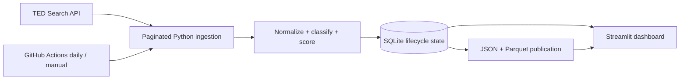

# AI Tender Intelligence for European Market Entry

An explainable data application that finds AI, machine-learning, analytics, and data-infrastructure opportunities in EU public procurement notices, with a market-entry focus on **Belgium, Italy, and Finland**.

This is an admissions portfolio project for 2027 European undergraduate applications. The first release prioritises clear reasoning, reproducible data work, and honest limitations over a black-box prediction claim.

> **Important:** the “opportunity score” is a transparent, configurable **profile-fit score**. It is not a bid recommendation and never estimates the probability of winning a tender.

## What works in the first iteration

- Anonymous search of published notices through the official EU TED Search API.
- Multi-page candidate retrieval using target countries, CPV families, and AI/data phrases.
- Normalization of country, buyer, CPV, performance place, budget, currency, deadline, and technology theme.
- Explainable CPV + multilingual keyword classification.
- SQLite storage with raw notice evidence, lifecycle state, and fetch-run metadata.
- Versioned public JSON and analysis-ready Parquet snapshots.
- A Streamlit dashboard that prefers SQLite and falls back to Parquet or JSON.
- Daily and manual GitHub Actions refreshes with no API secret.
- Unit and workflow tests for pagination, publication, lifecycle, data loading, and the analytical core.

## Data source

The project uses the Publications Office of the European Union's [TED Search API](https://docs.ted.europa.eu/api/latest/search.html), specifically `POST https://api.ted.europa.eu/v3/notices/search`. Search and retrieval of published notices are anonymously accessible; this project does not request or store an API key. Official documentation states a maximum of 250 notices per page and 15,000 retrievable notices in page-number mode; iteration mode is intended for larger extractions.

Expert-query syntax is documented in [TED Search and browse help](https://ted.europa.eu/en/help/search-browse). The classification system uses the EU [Common Procurement Vocabulary (CPV)](https://ted.europa.eu/en/simap/cpv).

## Architecture



See [the detailed architecture](docs/architecture.md), [data dictionary](docs/data_dictionary.md), [taxonomy](docs/taxonomy.md), and [methodology and limitations](docs/methodology_and_limitations.md).

## Quick start

Requirements: Python 3.12+ and an internet connection for the fetch step.

```bash
python3 -m venv .venv
source .venv/bin/activate
python -m pip install --require-hashes --only-binary=:all: -r requirements.txt
python -m pip install --no-build-isolation --no-deps -e .
python scripts/fetch_tenders.py
streamlit run app.py
```

Windows PowerShell activation:

```powershell
.venv\Scripts\Activate.ps1
```

Run tests:

```bash
pytest
```

The fetch command first asks TED to validate the generated query, then follows every result page. It saves a timestamped raw response in `data/raw/`, synchronizes lifecycle state in `data/processed/tenders.db`, and publishes `data/published/tenders.json` plus `data/published/tenders.parquet`.

Useful options:

```bash
python scripts/fetch_tenders.py --countries BEL ITA FIN --scope ACTIVE
python scripts/fetch_tenders.py --limit 50 --page-size 25
python scripts/fetch_tenders.py --dry-run
```

Omitting `--limit` requests the complete matching result set. A capped run is useful for development, but it is intentionally treated as incomplete and cannot close missing records. `--dry-run` validates the API query without retrieving or writing notices.

## Automated refresh

`.github/workflows/update-tenders.yml` runs at 08:17 `Europe/Istanbul` every day and can also be started from the GitHub Actions interface with **Run workflow**. The job installs the project, runs all tests, retrieves a complete `ACTIVE` snapshot, then commits only the JSON and Parquet publication files when they changed.

The workflow uses anonymous TED access and GitHub's built-in `GITHUB_TOKEN`; no repository secret is required. Scheduled workflows run from the default branch and can be delayed during periods of high Actions load. See GitHub's official documentation for [scheduled workflows](https://docs.github.com/en/actions/reference/workflows-and-actions/events-that-trigger-workflows#schedule) and [workflow permissions](https://docs.github.com/en/actions/writing-workflows/workflow-syntax-for-github-actions#permissions).

The local SQLite file and raw responses remain Git-ignored. On a fresh GitHub runner, the pipeline restores its previous lifecycle state from the committed JSON publication before comparing the new complete snapshot.

## Security controls

- TED links are restricted to canonical `https://ted.europa.eu` URLs before they reach HTML or Streamlit link components.
- Public text is length-bounded and stripped of control, surrogate, and bidirectional-formatting characters before storage.
- JSON restoration validates size, schema version, row count, unique identifiers, lifecycle values, trusted URLs, and SHA-256 content hashes. Parquet loading validates its size and analytical contract.
- Raw snapshots and SQLite files use owner-only local permissions; publication writes use exclusive temporary files and atomic replacement.
- Streamlit explicitly enables CORS and XSRF protection, uses strict SameSite XSRF cookies, limits message/upload sizes, and hides exception details from viewers.
- Python dependencies are version- and SHA-256-hash-locked in `requirements.txt`. Weekly and on-change security checks run `pip-audit`, Bandit, CodeQL, and the regression suite.
- GitHub Actions are pinned to full commit SHAs. The TED job has read-only repository access; only the isolated publication job receives `contents: write`.
- Local secrets, cloud credentials, private keys, raw responses, and databases are denied by Git ignore rules and by separate Docker/Cloud Build allowlists. No service-account key belongs in this repository.
- Dependabot, secret scanning, push protection, vulnerability alerts, and private vulnerability reporting provide continuing monitoring.

See [the security review](docs/security_review.md) and [reporting policy](SECURITY.md). Security controls reduce risk but do not replace an independent penetration test or hosting-layer protection.

## Repository map

```text
.
├── app.py                         # Streamlit dashboard
├── .github/workflows/
│   └── update-tenders.yml         # Daily + manual tested refresh
├── config/
│   ├── profile.json               # Explainable score weights
│   └── taxonomy.json              # CPV and keyword rules
├── data/
│   ├── raw/                       # Local API snapshots (Git-ignored)
│   ├── processed/                 # Local SQLite database (Git-ignored)
│   └── published/                 # Git-versioned JSON + Parquet snapshots
├── docs/                          # Architecture, dictionary, method, demo
├── requirements.txt               # Fully hashed Python dependency lock
├── SECURITY.md                    # Private vulnerability reporting policy
├── scripts/fetch_tenders.py       # Beginner-friendly pipeline entry point
├── sql/schema.sql                 # SQLite schema
├── src/tender_intelligence/       # Reusable Python modules
└── tests/                         # Fast automated tests
```

## Opportunity score

The score totals five visible components: country fit (20), theme fit (30), classification evidence (20), deadline runway (20), and budget clarity (10). The default profile is Belgium-first, Italy-second, and Finland-third. It is only a learning profile and should be replaced with a real organisation's capabilities before any practical use.

Every notice keeps the points and explanation for every component. No component depends on a hidden model.

## Known limitations

- TED is not a complete representation of every national or below-threshold procurement opportunity.
- CPV has no single AI code, so the classifier can produce false positives and false negatives.
- Multilingual keyword coverage is intentionally small in v0.1.
- Missing budgets, multiple lots, currencies, and delivery locations require more careful treatment.
- Country comparisons from a small `ACTIVE` snapshot are descriptive, not market-size estimates.
- `closed` means a record disappeared from a complete later `ACTIVE` snapshot; it is not proof of award, cancellation, or contract completion.
- Page-number retrieval is intentionally stopped above TED's 15,000-result ceiling; the query must then be narrowed or moved to iteration mode.
- GitHub's scheduled start time is not a real-time guarantee and may be delayed.
- The public Streamlit application has no authentication because it exposes only public, read-only analytical data. Authentication is required before adding private profiles, notes, or user data.
- Always read the official notice and procurement documents before making a decision.

Read the full [methodology and limitations](docs/methodology_and_limitations.md).

## Twelve-week project plan

| Week | Deliverable | Status after iteration 1 |
|---:|---|---|
| 1 | Scope, official API research, repository skeleton, live proof of concept | Complete |
| 2 | Normalized schema, data dictionary, reproducible ingestion | MVP complete; extend lot handling |
| 3 | CPV/keyword taxonomy and manual labelling guide | Baseline complete |
| 4 | Precision/recall evaluation and error analysis by country | Next |
| 5 | SQL analysis notebook/queries and data-quality report | Planned |
| 6 | Configurable profile-fit scoring and sensitivity checks | MVP complete; validate weights |
| 7 | Interactive opportunity dashboard | MVP complete |
| 8 | Country comparison: institutions, sectors, budgets, themes | MVP view; deepen analysis |
| 9 | Monthly trends, lifecycle tracking, and historical backfill | Lifecycle complete; backfill planned |
| 10 | Testing, accessibility, automation, source attribution, and limitations review | Automation + core tests complete |
| 11 | Three-minute demo recording, screenshots, and portfolio story | Script ready |
| 12 | Final README, release tag, application-ready reflection | Planned |

## Responsible use

This project ranks public information for exploration. It does not determine eligibility, provide legal advice, automate a bid, contact buyers, or modify any external account. API results remain attributable to TED, and the official notice is the source of truth.
