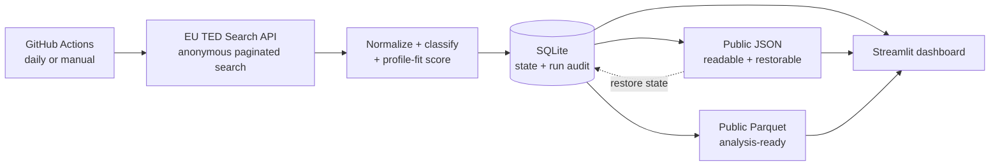

# Architecture

The first release deliberately uses a small local architecture. Every box can be inspected with beginner-level Python and SQL.

## Module map

| Module | Responsibility |
|---|---|
| `ted_client.py` | Build and validate the TED expert query; retrieve and combine result pages. |
| `normalize.py` | Convert multilingual and repeated TED fields to one analysis row. |
| `classifier.py` | Apply the versioned taxonomy and return matched evidence. |
| `scoring.py` | Calculate a configurable profile-fit score and component explanation. |
| `database.py` | Migrate SQLite, compare content hashes, assign lifecycle state, and audit refreshes. |
| `publication.py` | Atomically write JSON/Parquet and restore state from a prior JSON publication. |
| `data_source.py` | Load dashboard data in SQLite → Parquet → JSON priority order. |
| `pipeline.py` | Connect all stages, retain a raw snapshot, synchronize state, and publish outputs. |
| `app.py` | Present lifecycle filters, country comparison, trends, and notice-level explanations. |

## Why SQLite first?

SQLite is sufficient for an admissions portfolio prototype: it has no server to operate, is easy to inspect with SQL, and keeps the data pipeline reproducible. A later version can move to PostgreSQL without changing the normalized data contract.

## Data flow boundaries

- Raw API responses are immutable snapshots under `data/raw/` and are ignored by Git.
- Normalized records are synchronized by TED publication number and deterministic content hash.
- Only a complete `ACTIVE` refresh can mark an unseen in-scope notice as `closed`.
- SQLite is the preferred local source. Parquet and then JSON are deployment fallbacks.
- JSON and Parquet publications are committed by GitHub Actions; SQLite and raw responses are not.
- Taxonomy and score profile live in versioned JSON files, not hidden in code.
- The dashboard reads the database; it never calls TED directly.

## Refresh sequence

1. Validate the generated TED expert query.
2. Request pages of at most 250 records until the total is reached.
3. Normalize, classify, and score each returned notice.
4. Compare each content hash with the prior SQLite or restored JSON state.
5. Assign `new`, `updated`, or `unchanged`; mark missing records `closed` only after a complete `ACTIVE` refresh.
6. Atomically replace the JSON and Parquet publications.
7. Record page count, completeness, lifecycle counts, paths, and outcome in `fetch_runs`.

The GitHub workflow runs tests before step 1 and commits publication changes only after every pipeline step succeeds.

## Security boundaries

- TED is an external, untrusted input boundary even though it is an official source. Identifiers, text, response shapes, list sizes, numeric values, and outbound record URLs are validated before use.
- Raw responses remain local and owner-readable. Only normalized analytical fields are published.
- Publication restoration is fail-closed: an unsupported schema, oversized file, duplicate identifier, untrusted URL, invalid lifecycle value, or content-hash mismatch stops the refresh.
- The dashboard escapes all external text and revalidates every TED URL immediately before rendering a link.
- Dependency installation uses a hash-locked wheel-only set. Workflow actions use immutable commit SHAs.
- The network/data job receives a read-only GitHub token. A separate job downloads only the two publication artifacts and receives narrowly scoped write permission.
